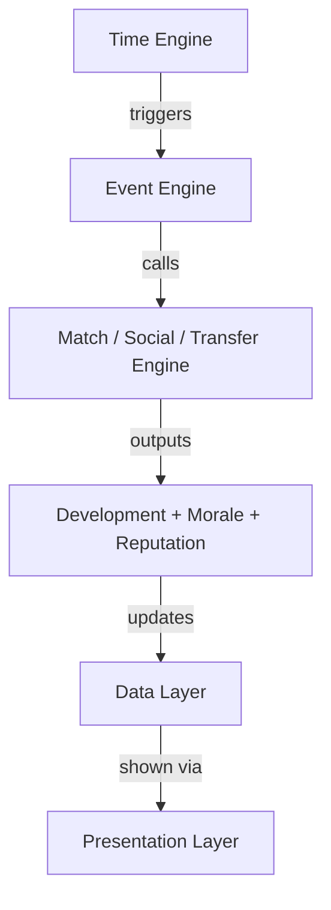

# 🏗️ TECHNICAL SYSTEM ARCHITECTURE
**Text-Based Football Career Simulation**

This defines how the game should be built internally, separated into clean, modular systems so it can scale from console → web app later.

## 1. CORE ARCHITECTURE PHILOSOPHY

The game should use a modular simulation engine with clear separation between:

| Layer | Responsibility |
|---|---|
| **Simulation Layer** | All game logic & world simulation |
| **Data Layer** | Player, teams, matches, competitions |
| **Interaction Layer** | User decisions & menus |
| **Presentation Layer** | Console now, Web UI later |

> The Simulation Layer must **NOT** depend on UI.
> This makes future web migration easy.

## 2. MAIN SYSTEM MODULES

### A. Time Engine
Controls the flow of time in the world.

**Responsibilities:**
- Advance time in small segments (in-game hours).
- Trigger scheduled events (matches, training, transfer deadlines).
- Check for random or dynamic events.
- Pause automatically when user input is required.

**Key Concepts:**

| Concept | Description |
|---|---|
| Time Tick | Smallest unit of simulation (e.g. 1 in-game hour) |
| Day Cycle | Groups ticks into daily structure |
| Event Queue | Stores upcoming scheduled events |

### B. Event Engine
Central nervous system of the game. Every important moment is an event.

**Event Types:**

| Type | Examples |
|---|---|
| Match Events | Match day, lineup decision |
| Career Events | Transfer offer, contract renewal |
| Social Events | Teammate talk, mentor offer |
| Manager Events | Training change request |
| Media Events | Interviews, rumors |
| Personal Events | Injury, morale swing |

**Responsibilities:**
- Store events in priority order.
- Interrupt time when required.
- Deliver events to Interaction Layer.

### C. Match Engine
Simulates football matches.

**Responsibilities:**
- Generate match timeline.
- Create match actions (passes, tackles, shots, saves, etc.).
- Use player attributes + form + morale.
- Calculate match ratings using:
    - Action impact multiplier
    - Positional responsibility multiplier
    - Match context importance

**Output:**
- Final score
- Player stats
- Match ratings
- Form changes

### D. Player Development Engine
Handles growth, decline, and form.

**Responsibilities:**
- Apply training effects daily/weekly.
- Apply match performance impact.
- Manage attribute growth curves (age-based).
- Apply morale effects to development speed.
- Handle hidden attributes influence.

### E. Training System

**Responsibilities:**
- Store manager-assigned focus.
- Compare with player preferred focus.
- Generate morale effects based on alignment.
- Feed growth modifiers into Development Engine.

### F. Morale & Personality Engine

**Responsibilities:**
- Track morale state.
- Update morale from:
    - Match results
    - Playing time
    - Relationships
    - Manager interactions
- Influence:
    - Performance consistency
    - Development rate
    - Social interaction outcomes

### G. Social & Relationship Engine
Tracks relationships between:
- Player ↔ Teammates
- Player ↔ Manager
- Player ↔ Media (abstracted)

**Responsibilities:**
- Store relationship values.
- Determine interaction success chances.
- Influence team chemistry.
- Affect morale & reputation.

### H. Reputation Engine
Two-layer system:

| Reputation Type | Scope | Update Frequency |
|---|---|---|
| **Local** | Fans, club, domestic media | Match-by-match |
| **International** | Global recognition | Seasonal / major events |

**Responsibilities:**
- Convert performances → local reputation.
- Gradually convert local → international.
- Influence:
    - Transfer interest
    - Awards
    - Media attention

### I. Competition Engine

**Responsibilities:**
- Manage leagues, cups, standings.
- Schedule fixtures.
- Track team performance.
- Trigger match events for Time Engine.

### J. Transfer & Contract Engine

**Responsibilities:**
- Generate transfer interest based on:
    - Reputation
    - Performance
    - Potential
- Create offers.
- Handle negotiations.
- Update contracts and club changes.

## 3. DATA LAYER STRUCTURE
These are core data models (not code, just structure).

- **Player**
    - Personal Info
    - Visible Attributes
    - Hidden Attributes
    - Morale
    - Form
    - Reputation (Local/International)
    - Contract Info
    - Relationships Map
    - Injury Status
    - Career Stats
- **Team**
    - Squad List
    - Starting XI logic
    - Tactical style (affects match simulation bias)
    - Manager profile
- **Match**
    - Teams
    - Lineups
    - Timeline of match actions
    - Result
    - Player ratings
- **Competition**
    - Teams
    - Fixtures
    - Standings
    - Rules
- **Event Object**
    - Event Type
    - Priority Level
    - Trigger Time
    - Requires User Input (Yes/No)
    - Outcome Paths

## 4. SYSTEM COMMUNICATION FLOW
Here’s how everything talks to each other:

## 5. INTERACTION LAYER (Console Now, Web Later)

The UI layer should **only**:
- Display data
- Present choices
- Send user decisions back to Event Engine

It should **NOT**:
- Calculate growth
- Simulate matches
- Modify stats directly

## 6. FUTURE WEB CONVERSION PREPARATION
To make web migration easy:

- [x] Keep simulation in standalone modules
- [x] Use serializable game state (save/load JSON-style structure)
- [x] Avoid console-specific logic in core systems
- [x] Event system must work without UI assumptions

## 7. DEVELOPMENT ORDER (FOR AI CODING ASSISTANT)
Build in this order:

1. Data Models
2. Time Engine
3. Event Engine
4. Player Development System
5. Morale System
6. Match Engine
7. Reputation System
8. Social System
9. Transfer System
10. Competition System
11. Console Interaction Layer

## ✅ RESULT
Following this structure ensures:
- Systems are modular
- Simulation is deep but manageable
- Game can scale in complexity
- UI can change without rewriting the game logic