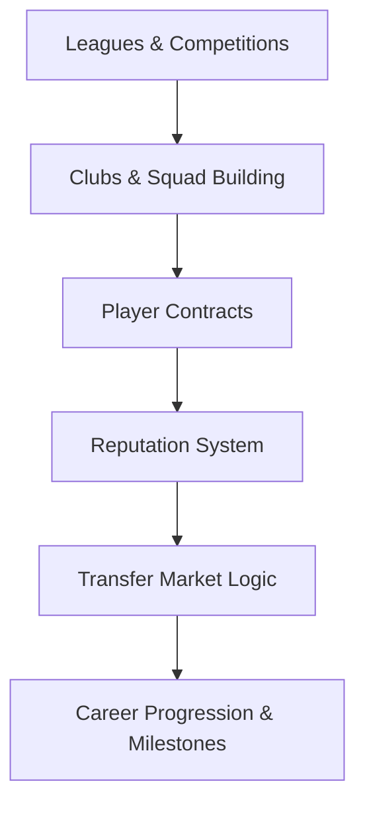

# 🌍 CAREER WORLD SYSTEM — FULL DESIGN

This system manages:
- Leagues & seasons
- Clubs & squads
- Contracts
- Transfers
- Reputation & career progression

It turns your match performances into a living football career.

## 1. SYSTEM OVERVIEW

## 2. LEAGUES & COMPETITIONS

### League Structure
Each league has:

| Property | Purpose |
|---|---|
| Name | League identity |
| Tier Level | Influences reputation value |
| Financial Strength | Affects wages & transfers |
| Play Style Bias | Impacts match tempo tendencies |
| Season Length | Number of matches |
| Reputation Value | How much performances here matter |

### Competition Types

| Type | Purpose |
|---|---|
| League | Main season competition |
| Domestic Cup | Knockout, high-pressure games |
| Continental | Highest reputation gain |
| Youth League | Early career development |

> Performances in higher-rep competitions give bigger boosts.

## 3. CLUB SYSTEM
Each club has identity and behavior.

### Club Attributes

| Attribute | Effect |
|---|---|
| Club Reputation | Attracts players |
| Financial Power | Transfer budgets |
| Youth Focus | Chance of young player development |
| Tactical Identity | Influences match style |
| Facilities Quality | Affects player growth |
| Medical Quality | Injury recovery speed |

### Squad Hierarchy

| Role | Impact |
|---|---|
| Star Player | High expectations |
| First Team | Regular starter |
| Rotation | Occasional playtime |
| Prospect | Development focus |
| Youth | Rarely plays |

**Squad role affects:**
- Playing time
- Morale
- Growth

## 4. CONTRACT SYSTEM
Contracts give structure to career decisions.

### Contract Properties

| Property | Description |
|---|---|
| Wage | Weekly salary |
| Length | Years remaining |
| Squad Role Promise | Expected usage |
| Release Clause | Transfer trigger value |
| Performance Bonuses | Goal/appearance bonuses |

### Contract Effects
- Low wage vs performance → morale drop
- Not meeting promised role → unhappy player
- Expiring contract → transfer interest increases

## 5. REPUTATION SYSTEM
Reputation is your career status meter.

### Reputation Types

| Type | Scope |
|---|---|
| Player Reputation | Global career status |
| League Reputation | League strength |
| Club Reputation | Club prestige |

### How Player Reputation Changes

| Action | Effect |
|---|---|
| High average rating season | Increase |
| Winning league/cups | Big boost |
| Individual awards | Major boost |
| Poor season | Drop |
| Long bench periods | Slow drop |

**Higher reputation unlocks:**
- Bigger clubs
- National team
- Sponsorship events (future feature)

## 6. TRANSFER MARKET SYSTEM
Clubs scout and sign players based on:

> **TransferInterestScore** =
> Player Ability
> \+ Potential
> \+ Reputation
> \+ Form
> − Age Decline Factor
> \+ Positional Need

### Transfer Triggers
A club bids when:
- Player fits tactical system
- They can afford wage + fee
- Player wants move (ambition, morale)

### Player Transfer Desire
Influenced by hidden traits:

| Trait | Effect |
|---|---|
| Ambition | Wants bigger leagues |
| Loyalty | Wants to stay |
| Ego | Wants star role |
| Professionalism | Focuses on development |

## 7. CAREER PROGRESSION STAGES
Your journey follows organic stages:

| Stage | Age Range | Focus |
|---|---|---|
| Youth Prospect | 15–18 | Growth & potential |
| Breakthrough Talent | 19–22 | First big seasons |
| Established Player | 23–27 | Prime years |
| Elite Star | 24–30 | Peak reputation |
| Veteran | 31+ | Decline & legacy |

> Events and media narratives change by stage.

## 8. SEASONAL WORLD LOOP
Each season:

1. League schedule generated
2. Matches simulated (with your involvement highlighted)
3. Standings update
4. Cups progress
5. Transfer windows open
6. Contracts reviewed
7. Awards given
8. Reputation updated
9. Then next season begins.

## 9. AWARDS & RECOGNITION
End-of-season awards:

| Award | Criteria |
|---|---|
| League Best Player | High ratings + team success |
| Top Scorer | Goals |
| Best Young Player | Age + performance |
| Team of the Season | Position rankings |
| World Player of the Year | Reputation + trophies |

**Awards give:**
- Huge morale boosts
- Reputation jumps
- Transfer interest spike

## 10. MEDIA & NARRATIVE SYSTEM (LIGHT)
Media adds immersion without heavy mechanics.

**Examples:**
- “Rising Star” after strong form
- “Out of Form” narrative
- “Transfer Speculation”
- “Club Legend” status

> Affects morale and reputation slightly.

## 11. WHAT THIS SYSTEM ENABLES

- [x] Realistic career ladder
- [x] Organic transfers
- [x] Meaningful competitions
- [x] Club personality
- [x] Long-term career storytelling