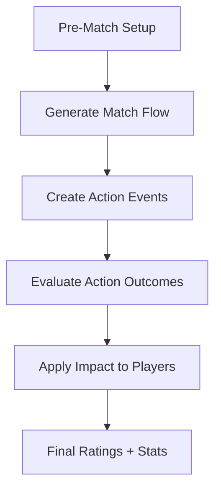

# ⚽ MATCH SIMULATION FRAMEWORK
**Text-Based Football Career Game**

This system simulates a football match and produces:
- Match result
- Player stats
- Match ratings
- Form changes
- Reputation impact

**It must feel realistic, varied, and role-aware.**

## 1. MATCH ENGINE OVERVIEW
A match is simulated as a sequence of Match Actions over time.

## 2. MATCH FLOW STRUCTURE
The match is divided into time slices (not necessarily shown to player):

| Phase | Minutes |
|---|---|
| Opening | 1–15 |
| Mid First Half | 16–35 |
| Late First Half | 36–45+ |
| Early Second Half | 46–65 |
| Mid Second Half | 66–80 |
| Late Game | 81–90+ |

> Each phase has different intensity weights (late game actions can matter more).

## 3. MATCH ACTION SYSTEM
Instead of rating by position only, we simulate all football actions, then adjust their importance.

### Core Action Categories

#### 🟢 Attacking Actions
- Goal
- Shot on target
- Shot off target
- Key pass
- Assist
- Successful dribble
- Dangerous run

#### 🔵 Defensive Actions
- Tackle won
- Interception
- Blocked shot
- Clearance
- Aerial duel won
- Goal-line clearance

#### 🟣 Goalkeeper Actions
- Save (routine)
- Save (difficult)
- 1v1 save
- Punch/claim cross

#### 🟡 Possession Actions
- Accurate pass
- Through ball
- Long ball success
- Ball retention under pressure

#### 🔴 Negative Actions
- Missed big chance
- Defensive error
- Failed tackle
- Bad turnover
- Penalty conceded
- Own goal

## 4. ACTION IMPACT MULTIPLIER SYSTEM
Each action has a base impact value, then gets modified by:

> **Final Impact** =
> Base Action Value
> × Match Context Multiplier
> × Position Responsibility Multiplier
> × Difficulty Modifier

### A. Base Action Values (Examples)
| Action | Base Value |
|---|---|
| Goal | +8.0 |
| Assist | +5.0 |
| Key Pass | +2.5 |
| Tackle Won | +2.0 |
| Interception | +2.0 |
| Save (Hard) | +4.5 |
| Defensive Error | -4.0 |
| Missed Big Chance | -3.5 |

*(These values are tuned so a perfect 10 rating is rare.)*

### B. Match Context Multiplier
How important was the moment?

| Situation | Multiplier |
|---|---|
| Opening goal | ×1.4 |
| Equalizer | ×1.5 |
| Late winning goal | ×1.8 |
| Goal in 5–0 win | ×0.7 |
| Last-minute defensive block | ×1.6 |

### C. Position Responsibility Multiplier
Rewards players for exceeding expectations of their role.

| Action Type | Defender | Midfielder | Attacker |
|---|---|---|---|
| Scoring Goal | ×1.25 | ×1.1 | ×1.0 |
| Goal-saving tackle | ×1.0 | ×1.1 | ×1.3 |
| Key Pass | ×0.9 | ×1.1 | ×1.2 |
| Clearance | ×1.2 | ×1.0 | ×0.8 |

**This ensures:**
- Defenders scoring = big boost
- Attackers defending heroically = big boost

### D. Difficulty Modifier
Based on player attributes vs opponent difficulty.
- Beating a world-class defender in a dribble → higher modifier
- Easy tap-in → lower modifier
- **Range:** 0.8 – 1.3

## 5. ACTION GENERATION LOGIC
Actions aren’t random — they’re influenced by:

| Factor | Influence |
|---|---|
| Player attributes | Technical success rates |
| Morale | Consistency and confidence |
| Form | Sharpness and impact frequency |
| Team tactics | Attack vs defense bias |
| Opponent strength | Difficulty scaling |
| Fatigue | Late match mistakes |

The engine determines:
1. Which team is attacking
2. Which player is involved
3. Which action type occurs
4. Whether it succeeds or fails

## 6. PLAYER INVOLVEMENT FREQUENCY
Better players influence the match more.

> **Involvement Score** =
> (Position Weight)
> × (Work Rate)
> × (Stamina Level)
> × (Team Tactical Role)

*Star players appear more often in key events.*

## 7. MATCH RATING CALCULATION
Every player starts at:
**Base Rating = 6.0**

Each action modifies rating using the Final Impact formula.

### Rating Boundaries
| Rating | Meaning |
|---|---|
| 9.5–10 | Legendary performance |
| 8.5–9.4 | Match winner |
| 7.5–8.4 | Excellent |
| 6.5–7.4 | Good |
| 5.5–6.4 | Average |
| 4.5–5.4 | Poor |
| <4.5 | Disaster |

**10.0 should require:**
- Multiple high-impact actions
- In decisive moments

## 8. POST-MATCH EFFECTS
After ratings are finalized:

### Form Update
- Good ratings → form boost
- Bad ratings → form drop
- *Form affects future performance probability.*

### Morale Impact
| Performance | Morale Change |
|---|---|
| Great match | Big boost |
| Average | Neutral |
| Poor | Decrease |

### Reputation Impact
**Local Reputation**
- Updated every match based on rating + key moments

**International Reputation**
- Only increases significantly after:
    - Big match performances
    - Awards
    - Continental competitions

## 9. MATCH REPORT OUTPUT (FOR PLAYER)
User sees:
- Final Score
- Key moments involving their player
- Personal match rating
- Stat line (goals, assists, tackles etc.)
- Form trend (↑ ↓ →)
- Reputation change (Local +X)

## 10. DESIGN GOALS ACHIEVED

- [x] Every position can shine
- [x] Context matters, not just raw stats
- [x] Rare 10/10 performances
- [x] Defensive and off-ball work matters
- [x] Underdog heroics feel special
- [x] Star players feel consistently influential