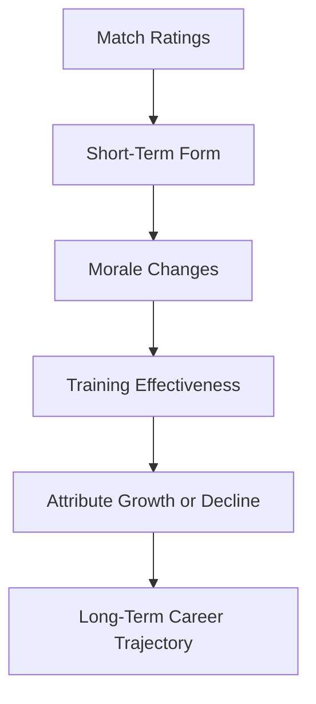

# 📈 PLAYER DEVELOPMENT & FORM SYSTEM

This system controls how a player improves, stagnates, or declines over seasons.

**It must feel:**
- Realistic
- Gradual
- Influenced by performance & personality
- Different for every player

## 1. SYSTEM OVERVIEW

## 2. MATCH RATING → FORM
Form represents recent performance level.

### Form Scale
| Value | Meaning |
|---|---|
| 0–20 | Terrible form |
| 21–40 | Poor |
| 41–60 | Average |
| 61–80 | Good |
| 81–100 | Excellent |

### Updating Form After Each Match
Form is a rolling average of last 5–8 matches with weight on recent games.

| Match Rating | Form Effect |
|---|---|
| 9.0+ | Large increase |
| 8.0–8.9 | Medium increase |
| 7.0–7.9 | Small increase |
| 6.5–6.9 | Neutral |
| 6.0–6.4 | Small decrease |
| <6.0 | Large decrease |

**Modifiers:**
- Big match performance = extra boost
- Long time without playing = slow decay

## 3. FORM → MORALE
Morale reflects confidence and happiness.

### Morale Scale
| Value | State |
|---|---|
| 0–20 | Very Unhappy |
| 21–40 | Unhappy |
| 41–60 | Okay |
| 61–80 | Happy |
| 81–100 | Very Happy |

### How Form Affects Morale

| Form Level | Morale Trend |
|---|---|
| Excellent Form | Steady morale increase |
| Good Form | Slight increase |
| Average | Stable |
| Poor Form | Morale drops |
| Terrible Form | Sharp morale drop |

**Other morale factors:**
- Playing time
- Media praise/criticism
- Team performance
- Contract status

## 4. MORALE → PERFORMANCE FEEDBACK
Morale directly influences match engine:

| Morale Level | Match Impact |
|---|---|
| Very Happy | Slight boost to decision-making & composure |
| Happy | Minor boost |
| Okay | Neutral |
| Unhappy | Slight performance drop |
| Very Unhappy | Noticeable performance drop |

**This creates:**
- Good form → Confidence → Better performances → Growth
- Or the opposite spiral.

## 5. TRAINING & DEVELOPMENT ENGINE
Players improve weekly, not instantly.

### Weekly Development Cycle
Each week:

> **BaseGrowthRate**
> × AgeFactor
> × TrainingIntensity
> × Professionalism (hidden)
> × MoraleModifier
> × FormModifier
> × InjuryStatusModifier
> = **WeeklyAttributeGrowthPoints**

*These points are distributed across attributes.*

### AGE FACTOR (CRITICAL)

| Age Range | Growth Pattern |
|---|---|
| 15–18 | Fast physical & technical growth |
| 19–23 | Peak growth years |
| 24–27 | Slower growth |
| 28–30 | Plateau |
| 31+ | Gradual decline begins |

### ATTRIBUTE GROWTH TARGETING
Growth is not random. It is influenced by:
- Training Focus (user choices)
- Match Role
- Play Style
- Hidden Potential Ceiling

**Example:**
- Winger with high match dribbles → Dribbling grows faster
- Defender making many tackles → Defensive Awareness improves

### POTENTIAL LIMIT
Every player has:
- Current Ability (CA)
- Potential Ability (PA)

> Growth slows dramatically near PA.

| CA vs PA | Growth Speed |
|---|---|
| Far below PA | Fast |
| Close to PA | Slow |
| At PA | Stops |

**Late bloomers may get small PA increases via:**
- Exceptional seasons
- High professionalism

## 6. DECLINE SYSTEM (AGING & WEAR)
Decline starts based on:
- Age
- Injury history
- Minutes played per season
- Durability (hidden attribute)

### Decline Order
1. Pace
2. Acceleration
3. Stamina
4. Agility
5. Then technical decline slowly

> Players with **High Professionalism** and **High Durability** decline more slowly.

## 7. FORM STREAK EFFECTS

### Hot Streak
**5+ good games:**
- Temporary attribute boost (+1–3 mental stats)
- Increased media attention
- Transfer interest

### Bad Run
**5+ poor games:**
- Confidence penalty
- Manager trust drops
- Possible benching

## 8. PERSONALITY IMPACT ON DEVELOPMENT

| Hidden Trait | Effect |
|---|---|
| Professionalism | Boosts training gains |
| Ambition | Pushes growth when morale high |
| Consistency | Stable performances = stable growth |
| Temperament | Bad reactions = morale crashes |
| Ego | Poor form hits morale harder |

## 9. SEASON PERFORMANCE REVIEW
At season end:
- Average Rating influences reputation
- Big awards boost morale massively
- Poor seasons may reduce development confidence

### Breakthrough Boost
Young players can get:
> **Small PA increase after exceptional season**

## 10. PLAYER TYPES EMERGE NATURALLY
This system creates:

| Type | How It Happens |
|---|---|
| Wonderkid | High PA + high professionalism |
| Late Bloomer | Moderate PA + strong morale + play time |
| Flop | High PA + low professionalism |
| Journeyman | Medium stats + consistent morale |
| Veteran Leader | High leadership + experience |

> No scripting required — systems create stories.

## 11. WHAT THE CODING ASSISTANT MUST ENSURE

- [x] Growth is gradual and capped
- [x] Form matters short-term, not permanently
- [x] Morale never overrides skill completely
- [x] Decline is slow, not sudden
- [x] Hidden attributes subtly guide outcomes