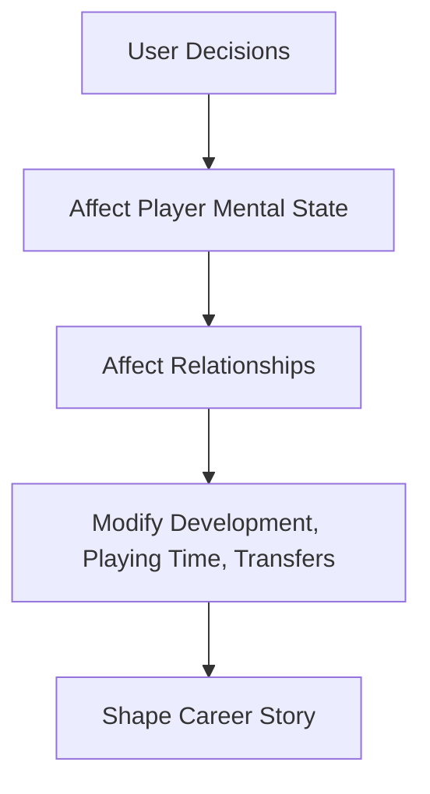

# 🎮 PLAYER DECISION & INTERACTION SYSTEM

This is where the user makes choices that influence:
- Development
- Career path
- Relationships
- Reputation
- Long-term trajectory

**The player does not control matches directly — they control the life and career decisions around them.**

## 1. SYSTEM OVERVIEW

## 2. TRAINING FOCUS SYSTEM (MANAGER-LED WITH PLAYER INPUT)
This is a dynamic negotiation system, not a stat picker.

### 🎯 Training Focus Types
Each focus boosts growth speed in certain attributes.

| Focus | Example Attribute Bias |
|---|---|
| Finishing | Finishing, Composure |
| Playmaking | Passing, Vision |
| Defensive | Tackling, Positioning |
| Physical | Stamina, Strength, Pace |
| Mental | Decisions, Anticipation |

### 👔 Default Behavior — Manager Assigned
The manager chooses training focus based on:
- Player position
- Tactical role
- Team needs
- Weakest attributes

> *Example: Young winger with poor crossing → Manager assigns Attacking/End Product Focus*

### 🗣️ Player Request Mechanic
If the user feels development is going wrong, they can:
> **“Request Training Focus Change”**

This triggers an interaction event.

### Manager Response Logic
Manager response depends on:

| Factor | Effect |
|---|---|
| Manager Personality (hidden) | Strict vs flexible |
| Player Form | Good form = more leverage |
| Local Reputation | Star players get more say |
| Relationship Level | Trust matters |
| Professionalism (hidden) | Manager trusts serious players |

### Possible Outcomes
| Result | Effect |
|---|---|
| Manager Agrees | Focus changes, morale boost |
| Manager Compromises | Partial change |
| Manager Refuses | No change, morale drop |

**Repeated ignored requests may:**
- Reduce morale
- Increase transfer desire

### 📈 Training Effect Impact
- **When focus aligns with player request AND high morale:**
  - → Growth efficiency bonus
- **When forced into unwanted focus:**
  - → Slight morale penalty, slower growth

## 3. CAREER DIALOGUE EVENTS
At key moments, the user gets choices.

### 🎤 Manager Conversations
**Situations:**
- Not getting play time
- Being played out of position
- Training disagreements

**Choices might be:**
| Option | Personality Impact |
|---|---|
| Respectful | Boost relationship |
| Demanding | Risk relationship, faster results |
| Silent | No change |

### 📰 Media Interactions
After big performances or bad form:

| Tone Choice | Effect |
|---|---|
| Confident | Boost morale, raise expectations |
| Humble | Stable morale |
| Defensive | Risk media backlash |

> *Media handling hidden attribute influences outcome.*

### 🤝 Teammate Relationships (Light System)
- **Good morale and leadership:**
  - Boost team morale
  - Slight match bonuses
- **Poor morale:**
  - No bonuses

## 4. PLAYING TIME EXPECTATION SYSTEM
Player has an expectation based on:
- Squad role
- Reputation
- Form

**If actual minutes < expectation:**

| Time Period | Effect |
|---|---|
| 2–3 matches | Minor morale drop |
| 5+ matches | Major morale drop |
| Long term | Transfer request possible |

## 5. TRANSFER DECISION INTERACTIONS
When offers arrive, the user chooses:

| Choice | Outcome |
|---|---|
| Push for move | Club more likely to sell |
| Stay loyal | Morale boost |
| Demand transfer | Relationship damage |

> *Ambition & loyalty traits modify outcomes.*

## 6. CONTRACT NEGOTIATION EVENTS
When contract expires or performance rises:

**User may request:**
- Higher wage
- Bigger squad role
- Release clause

**Manager/club reaction depends on:**
- Performance
- Reputation
- Club finances

## 7. PERSONAL DEVELOPMENT EVENTS
Occasional off-field choices:

| Event | Example Choices | Effect |
|---|---|---|
| Extra training | Work harder vs rest | Fitness vs fatigue |
| Lifestyle discipline | Party vs focus | Morale vs professionalism |
| Mentorship | Learn from veteran | Mental growth boost |

> *These are rare but impactful.*

## 8. SYSTEM DESIGN GOALS

- [x] User influences career without micromanaging stats
- [x] Manager still feels in control (realism)
- [x] Personality traits matter in interactions
- [x] Choices have trade-offs, not obvious “best” option

## 9. HOW THIS CONNECTS TO OTHER SYSTEMS

| This System | Impacts |
|---|---|
| Training Focus | Attribute growth |
| Morale | Match performance |
| Manager Relationship | Playing time |
| Media Choices | Reputation |
| Transfer Decisions | Career trajectory |